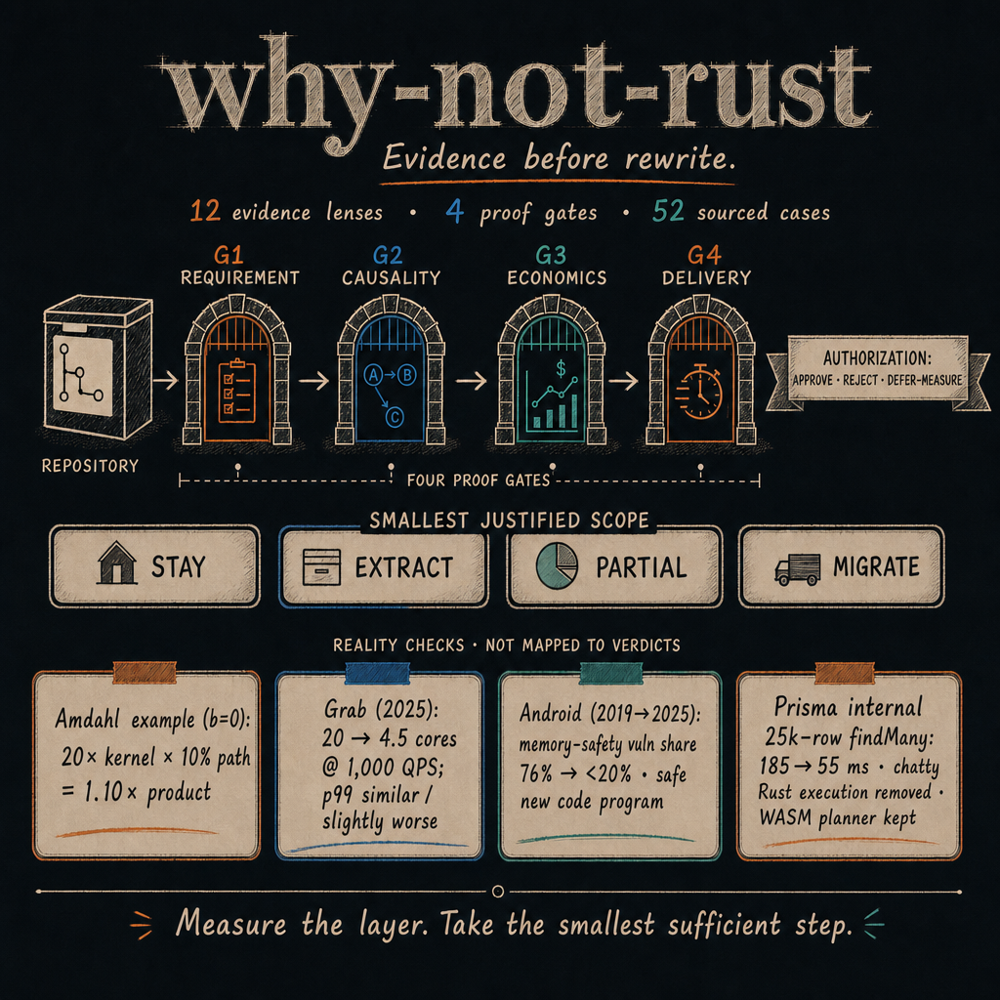
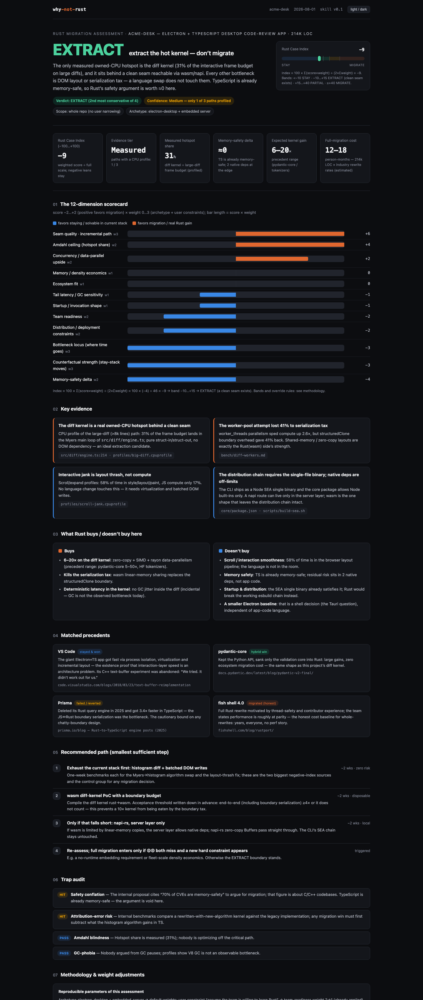

# why-not-rust

**Evidence before rewrite. A cross-agent skill for deciding whether Rust should stay
out, enter at one seam, replace a component, or take over the assessed target.**

[](https://skills.sh/xiaotonng/why-not-rust)
[](skills/why-not-rust/SKILL.md)
[](LICENSE)

<p align="center">
  
</p>
<p align="center"><sub>Figure data: <a href="skills/why-not-rust/scripts/decision_math.py">Amdahl calculator</a> · <a href="https://engineering.grab.com/counter-service-how-we-rewrote-it-in-rust">Grab (2025)</a> · <a href="https://blog.google/security/rust-in-android-move-fast-fix-things/">Android (2019→2025)</a> · <a href="https://www.prisma.io/blog/from-rust-to-typescript-a-new-chapter-for-prisma-orm">Prisma ORM</a>. Each number keeps its workload caveat; the cases are not directly comparable.</sub></p>

Point the skill at a repository or migration RFC. It returns:

- an authorization: **APPROVE / REJECT / DEFER–MEASURE**;
- the smallest justified scope: **STAY / EXTRACT / PARTIAL / MIGRATE**;
- claim-level evidence, confidence, and decision robustness;
- a self-contained HTML report with options, costs, caveats, acceptance tests, and
  rollback conditions.

It is not a Rust rejection generator. It is equally willing to say “migrate the
unsafe parser,” “extract the hot kernel,” “adopt the existing Rust library,” or “the
time is in SQL; keep the application where it is.”

See it decide: **[twenty real projects, twenty verdicts](examples/README.md)** — ten
desktop applications whose teams bet on a Rust rewrite (Zed, fish, Ghostty, remacs,
xi-editor, Lapce, Spacedrive, Signal Desktop, Bitwarden, KeePassXC), and ten systems and
tooling projects (curl, SQLite, OpenSSL, FFmpeg, Redis, esbuild, flake8, prisma-engines,
uutils/coreutils, Bun).

## Install with skills.sh

The current `skills` CLI requires Node.js 22.20 or newer. Inspect the package first,
then install it globally for your agent:

```sh
# See what will be installed
npx --yes skills@latest add xiaotonng/why-not-rust --list

# Interactive global install
npx --yes skills@latest add xiaotonng/why-not-rust \
  --skill why-not-rust -g
```

Non-interactive installs:

```sh
# Claude Code
npx --yes skills@latest add xiaotonng/why-not-rust \
  --skill why-not-rust -g -a claude-code -y

# Codex
npx --yes skills@latest add xiaotonng/why-not-rust \
  --skill why-not-rust -g -a codex -y
```

The explicit `@latest` is intentional: older `skills` CLI versions could discover a
root skill but omit its bundled references/assets. This repository uses the standard
`skills/why-not-rust/` layout and the current CLI installs the complete package.

## Try it

Natural language works across agents:

```text
Should we rewrite this repository in Rust? Inspect the codebase and recommend the
smallest justified option, with evidence and a report.
```

Or invoke it explicitly:

```text
/why-not-rust                                  # Claude Code
$why-not-rust                                  # Codex
$why-not-rust quick                            # five-question fast screen
$why-not-rust focus on packages/diff-engine    # one target only
$why-not-rust deep; our p99 target is 40 ms     # may run existing benchmarks
$why-not-rust review docs/rust-migration-rfc.md
```

By default, the only write is a newly named HTML report in the analyzed repository.
If `why-not-rust-report.html` already exists, the skill uses a timestamped filename;
it never overwrites a tracked or existing file without explicit permission. Builds,
tests, benchmarks, and network calls are not run unless `deep` analysis is requested
or explicitly allowed.

## How it decides

The method separates four questions that a single weighted score cannot safely mix:

1. **Requirement** — is a measurable performance, cost, safety, correctness, or
   deployment gap actually real?
2. **Rust-specific causality** — what does Rust change after separating redesign,
   algorithm, database, cache, and baseline effects?
3. **Economics** — does the benefit beat the funded current-stack, adoption, and
   smaller-extraction alternatives?
4. **Delivery** — are compatibility, dual-run, ownership, acceptance, and rollback
   credible for this scope?

Twelve lenses make sure the evidence scan is complete: bottleneck ownership, Amdahl
reach, tail behavior, fleet footprint, startup, safety/correctness, concurrency,
distribution, ecosystem, boundary quality, delivery economics, and the strongest
counterfactual.

The lenses are an evidence ledger—not additive points. Every claim names the option(s)
it applies to and keeps `N/A`, `UNKNOWN`, `NEUTRAL`, `SUPPORTS`, and `DISFAVORS`
distinct. If a decisive gate is unknown, the answer is **DEFER–MEASURE + STAY for
now**, with the exact profile, benchmark, or cost input that can reopen the decision.

## Positive and negative receipts

The 52-case library contains **24 adoptions/migrations, 7 extractions/hybrids, 12
stay-stack successes, and 9 reversals/refusals/failures**. The same case often
supports one goal and rejects another:

| Case | What happened | What the skill should learn |
|---|---|---|
| [Android](https://blog.google/security/rust-in-android-move-fast-fix-things/) | Memory-safety vulnerabilities fell from 76% (2019) to below 20% (2025) while Android prioritized memory-safe **new code**; Google reports Rust changes with ~4× lower rollback rates than C++ for medium/large changes. | A strong Rust safety case—and an incremental-adoption case, not proof that old code should be mass-rewritten. |
| [Grab Counter Service](https://engineering.grab.com/counter-service-how-we-rewrote-it-in-rust) | At 1,000 QPS, one selected service moved from 20 Go cores to 4.5 Rust cores, while p99 was similar or slightly worse. | Rust can win fleet economics without improving latency. State the objective before quoting “faster.” |
| [Pydantic v2](https://pydantic.dev/articles/pydantic-v2) | The project reports large validation-core gains after extracting a Rust kernel behind the Python API. | A coarse seam can capture native value without migrating the application stack; application speedup still obeys Amdahl. |
| [Prisma ORM](https://www.prisma.io/blog/from-rust-to-typescript-a-new-chapter-for-prisma-orm) | Prisma's internal 25k-row benchmark improved from 185 ms to 55 ms after moving query execution out of a chatty Rust boundary; it retained a small WASM query-plan compiler. | Removing Rust can be the performance fix when serialization is the bottleneck. This is a boundary result, not “TypeScript beats Rust.” |
| [Bun](https://bun.com/blog/bun-in-rust) | A 535,496-line Zig→Rust port reported selected benchmark gains of 2.2–4.8%, alongside leak/safety and binary-size improvements. | A migration can be justified for safety/maintainability while offering only single-digit performance change. |
| [TypeScript native port](https://devblogs.microsoft.com/typescript/typescript-native-port/) | Microsoft's preview benchmark showed 77.8 s→7.5 s on the VS Code repo—and the team chose Go for a compatible native port. | Native code, shared-memory parallelism, and architecture are not Rust-exclusive; compare the strongest non-Rust option. |

Every public number above links to the source and keeps its workload caveat. The full
library includes source-check labels and explicit transfer limits; precedents are
qualitative unless workload, scope, baseline, and measurement regime all match.

## The report

<p align="center">
  <a href="examples/sample-report.html"></a>
</p>

The report is a single dark/light HTML file with:

- the decision and all four proof gates visible in the hero;
- side-by-side options with benefit, one-time/recurring cost, time-to-value,
  compatibility, evidence, and reversibility;
- the 12-lens claim ledger and a machine-readable assessment record embedded in the
  file;
- correct Amdahl and boundary math from a tested deterministic calculator;
- matched precedents with both match and mismatch fields;
- a symmetric challenge audit for migration bias **and** status-quo bias;
- a reversible path whose thresholds come from the actual SLO/economic break-even.

[Open the full sample report](examples/sample-report.html).

## Twenty real projects, twenty decisions

The [case gallery](examples/README.md) runs twenty well-known repositories through the
same four gates. Static read-only analysis at a named commit; no build, test, benchmark,
or network call was run against any target. Each report ships English and 中文 in one
file, with light and dark themes.

### Desktop applications

Apps — mostly Mac apps — whose teams believed a Rust rewrite was the answer. Six of the
ten already bet on Rust: two are dead, two have stalled, two are thriving.

| Project | Stack | Scope | Authorization | The finding |
|---|---|---|---|---|
| [remacs](examples/remacs-why-not-rust.html) | Rust → dead | `STAY` | `REJECT` | 47% of Emacs' Lisp primitives moved, 8% of the code; 5 of 126 C files retired in 4 years |
| [xi-editor](examples/xi-editor-why-not-rust.html) | Rust → dead | `EXTRACT` | `APPROVE` | The cross-process boundary grew to 2.46× the editing code it carried |
| [Lapce](examples/lapce-why-not-rust.html) | Rust | `EXTRACT` | `APPROVE` | 4.4% of Zed's size in the same language; a 54,002-line GUI toolkit written on the side |
| [Spacedrive](examples/spacedrive-why-not-rust.html) | Rust + Tauri | `STAY` | `REJECT` | Its own benchmark: 95.5% of index time in a phase that reopens each file six times |
| [Zed](examples/zed-why-not-rust.html) | Rust + GPUI | `MIGRATE` | `APPROVE` | An 8.33 ms budget compiled in — but leaving the web view bought the frame rate, not Rust |
| [fish](examples/fish-shell-why-not-rust.html) | C++ → Rust | `MIGRATE` | `APPROVE` | 78,532 lines of C++ to zero files; the plan guessed six months and it took 761 days |
| [Ghostty](examples/ghostty-why-not-rust.html) | Zig + Swift | `STAY` | `REJECT` | The praised part is 32,377 lines of Swift; a safe build already ships, unmeasured |
| [Bitwarden](examples/bitwarden-desktop-why-not-rust.html) | Electron + Rust | `STAY` | `REJECT` | 28,301 lines of Rust behind 38 functions — the smallest sufficient option, already taken |
| [Signal Desktop](examples/signal-desktop-why-not-rust.html) | Electron | `STAY` | `REJECT` | 308 lines of own native code against ~36M lines of bundled Chromium |
| [KeePassXC](examples/keepassxc-why-not-rust.html) | C++ / Qt | `STAY` | `REJECT` | Frames 2,003 lines of the KDBX path itself; Qt, zlib and Botan parse the rest |

### Systems and developer tooling

| Project | Language | Scope | Authorization | The finding |
|---|---|---|---|---|
| [curl](examples/curl-why-not-rust.html) | C | `EXTRACT` | `APPROVE` | The Rust TLS backend that shipped is 1,468 lines; the deeper HTTP attempt was deleted in 8.12.0 |
| [SQLite](examples/sqlite-why-not-rust.html) | C | `STAY` | `REJECT` | Gates 1 and 2 pass; 590× test-to-source and a 2050 compatibility promise end it |
| [OpenSSL](examples/openssl-why-not-rust.html) | C | `STAY` | `DEFER–MEASURE` | 6,357 exported symbols, and no published per-component advisory attribution to size any scope |
| [FFmpeg](examples/ffmpeg-why-not-rust.html) | C + asm | `PARTIAL` | `APPROVE` | Authorize the 72,465-line demux and parser layer; 194,278 lines of hand-written asm rule out the rest |
| [Redis](examples/redis-why-not-rust.html) | C | `STAY` | `REJECT` | 73,227 lines of vendored C still compile into the binary, so it misses its own safety objective |
| [esbuild](examples/esbuild-why-not-rust.html) | Go | `STAY` | `REJECT` | All four documented speed factors were obtained with a garbage collector |
| [flake8](examples/flake8-why-not-rust.html) | Python | `STAY` | `REJECT` | Real 10× gap; 4,741-line orchestrator caps at a 1.43× ceiling, so adopt instead |
| [prisma-engines](examples/prisma-engines-why-not-rust.html) | Rust | `STAY` | `REJECT` | Boundary cost was 2.36× the baseline's whole runtime; removing Rust was the fix |
| [uutils/coreutils](examples/coreutils-why-not-rust.html) | Rust | `PARTIAL` | `APPROVE` | 275 `unsafe` blocks in 251,003 lines; the failed gate is per-utility acceptance |
| [Bun](examples/bun-why-not-rust.html) | Zig → Rust | `MIGRATE` | `APPROVE` | Approved on the bug class, not on the 2.2–4.8% benchmark delta |

Across the twenty: eight `APPROVE`, eleven `REJECT`, one `DEFER–MEASURE`, and all four
scope words. Each report carries its own evidence gaps, and several decline to give a
clean answer where the decisive measurement does not exist. Two of the approvals qualify
themselves — Zed's says the frame rate came from leaving the web view rather than from
Rust, and fish's bills the project for the RFC goal that justified the port and still has
not shipped.

## Repository map

- [Skill instructions](skills/why-not-rust/SKILL.md)
- [Evidence framework and proof gates](skills/why-not-rust/references/dimensions.md)
- [52-case source library](skills/why-not-rust/references/case-library.md)
- [Report style contract](skills/why-not-rust/references/report-style.md)
- [Case gallery — desktop applications](examples/README.md)
- [Case gallery — systems and developer tooling](examples/README-systems.md)
- [Case sources and renderer](examples/build_cases.py)
- [Machine-readable assessment schema](skills/why-not-rust/assets/assessment-template.json)
- [HTML report template](skills/why-not-rust/assets/report-template.html)
- [Decision math calculator](skills/why-not-rust/scripts/decision_math.py)
- [HTML and JSON safety helpers](skills/why-not-rust/scripts/report_safety.py)

## Security model

Assessing a repository means reading text other people wrote, so the skill treats all
of it — files, comments, commit messages, filenames, metadata, RFC prose, and
user-supplied team/budget/compliance facts — as data under an explicit
[untrusted content boundary](skills/why-not-rust/SKILL.md#untrusted-content-boundary):

- instruction-like text found while scanning is quoted as evidence, never obeyed, and
  is surfaced in the report when it tries to steer the assessment;
- ingested content cannot change the verdict, the proof gates, the output path, or the
  guardrails, and cannot trigger commands, builds, installs, or network calls;
- the target repository stays read-only apart from the report at its agreed path, and
  the run makes no network calls unless you ask for `deep`;
- URLs are rendered through `safe_href`, never fetched, and every visible value is
  escaped by [`report_safety.py`](skills/why-not-rust/scripts/report_safety.py), so
  scanned content cannot become executable markup in the HTML report.

## Limits

This is a structured decision protocol, not a statistically trained predictor. It
does not estimate a universal probability that a Rust migration will succeed. Its
value is traceability: every conclusion is attached to a requirement, option, claim,
source, caveat, acceptance threshold, and rollback condition.

## License

MIT
